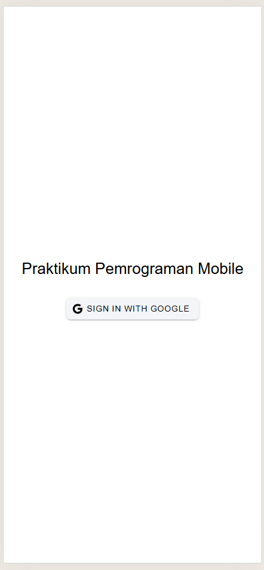
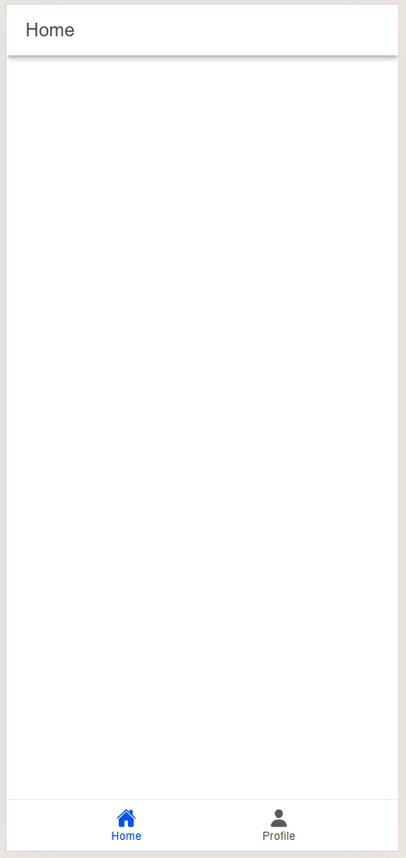
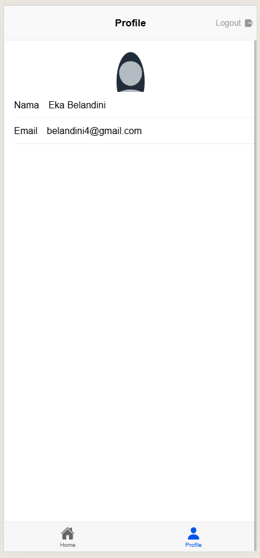
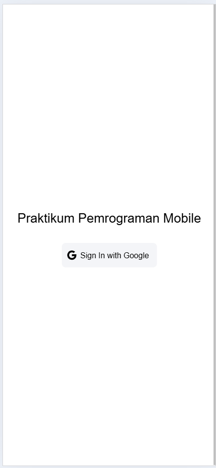

# Tugas 9 - Pertemuan 10

**Nama**  : Eka Belandini  
**NIM**   : H1D022002  
**Shift** : F

## Deskripsi Proyek

Proyek ini adalah aplikasi mobile sederhana yang dikembangkan menggunakan framework Ionic dan Vue. Aplikasi ini memungkinkan pengguna untuk login menggunakan akun Google dan melihat profil mereka, termasuk foto profil, nama, dan email.

## Fitur Utama

- **Autentikasi Google**: Pengguna dapat login menggunakan akun Google.
- **Menampilkan Profil Pengguna**: Setelah login, aplikasi akan menampilkan foto profil, nama, dan email pengguna.
- **Logout**: Pengguna dapat logout untuk keluar dari aplikasi.

## Cara Kerja

### Alur Kerja

1. **Login dengan Akun Google**:
   - Pengguna mengklik tombol login Google untuk memulai proses autentikasi menggunakan Firebase Authentication.
2. **Mengambil Data Pengguna**:
   - Setelah login, data pengguna (termasuk foto profil, nama, dan email) diambil dan disimpan di aplikasi.
3. **Menampilkan Foto Profil**:
   - Foto profil pengguna ditampilkan di halaman profil menggunakan URL foto dari Firebase.
4. **Logout**:
   - Pengguna dapat keluar dari aplikasi menggunakan tombol logout.

### Struktur File

- **auth.ts**:
  - Mengatur logika autentikasi, termasuk login dan logout menggunakan Firebase Authentication.
- **ProfilePage.vue**:
  - Menampilkan halaman profil pengguna, termasuk foto profil, nama, dan email.
- **router/index.ts**:
  - Mengatur routing aplikasi dan memastikan pengguna hanya dapat mengakses halaman profil setelah login.

## Demo Aplikasi

### Screenshot Halaman Login
1. **Sebelum Login**
   <br/>

   Pengguna dapat mengklik tombol "Login dengan Google" untuk memulai proses login.

2. **Setelah Login**
   <br/>

   Setelah berhasil login, pengguna diarahkan ke halaman home.

### Screenshot Halaman Profil
1. **Profil Pengguna**
   <br/>

   Foto profil pengguna, nama, dan email akan ditampilkan di halaman profil.

### Screenshot Logout
1. **Setelah Logout**
   <br/>

   Pengguna dapat logout dan kembali ke halaman login.

## Cara Menambahkan dan Menampilkan Foto Profil

### 1. **Mengambil Foto Profil Pengguna**

Setelah pengguna berhasil login menggunakan akun Google, Firebase Authentication menyediakan informasi pengguna melalui objek `user`. Salah satu properti dari objek `user` adalah `photoURL`, yang berisi URL gambar profil pengguna.

Berikut adalah cara untuk mengambil dan menampilkan foto profil pengguna:

```ts
import { defineStore } from 'pinia';
import { auth, googleProvider } from '@/utils/firebase';
import { signInWithPopup, signOut } from 'firebase/auth';

export const useAuthStore = defineStore('auth', {
    state: () => ({
        user: null,  // Menyimpan data pengguna setelah login
    }),
    actions: {
        async login() {
            const result = await signInWithPopup(auth, googleProvider);
            this.user = result.user;  // Simpan data pengguna
        },
        async logout() {
            await signOut(auth);
            this.user = null;  // Menghapus data pengguna setelah logout
        },
    },
});
```

Pada `this.user` akan terdapat berbagai informasi tentang pengguna, termasuk foto profil (`photoURL`).

### 2. **Menampilkan Foto Profil di Halaman Profil**

Setelah login, kita bisa menampilkan foto profil pengguna di halaman profil aplikasi. Dalam hal ini, kita akan menambahkan elemen `ion-avatar` untuk menampilkan foto profil pengguna. Foto profil yang akan ditampilkan adalah URL yang terdapat pada properti `photoURL` dari objek pengguna yang berhasil login.

Berikut adalah contoh implementasi di halaman profil (`ProfilePage.vue`):

```vue
<template>
    <ion-page>
        <ion-header>
            <ion-toolbar>
                <ion-title>Profile</ion-title>
                <ion-button slot="end" @click="logout">Logout</ion-button>
            </ion-toolbar>
        </ion-header>
        <ion-content>
            <!-- Avatar Profil -->
            <div id="avatar-container">
                <ion-avatar>
                    
                </ion-avatar>
            </div>
            <!-- Data Profil Pengguna -->
            <ion-list>
                <ion-item>Name: {{ user?.displayName }}</ion-item>
                <ion-item>Email: {{ user?.email }}</ion-item>
            </ion-list>
        </ion-content>
    </ion-page>
</template>

<script setup lang="ts">
import { useAuthStore } from '@/stores/auth';

const authStore = useAuthStore();
const user = authStore.user;  // Ambil data pengguna yang disimpan di store

// Fungsi logout
const logout = () => {
    authStore.logout();
};
</script>

<style scoped>
#avatar-container {
    display: flex;
    justify-content: center;
    align-items: center;
    margin: 20px 0;
}

ion-avatar {
    width: 100px;
    height: 100px;
}
</style>
```

#### Penjelasan:
- **`user?.photoURL`**: Properti ini mengakses URL foto profil pengguna yang sudah login. Jika pengguna belum mengunggah foto, kita akan menggunakan foto profil default dari Ionic (`'https://ionicframework.com/docs/img/demos/avatar.svg'`).
- **`ion-avatar`**: Komponen Ionic yang digunakan untuk menampilkan gambar dengan bentuk bulat. Foto profil pengguna akan dimasukkan ke dalam komponen ini.

Dengan kode di atas, foto profil pengguna yang berhasil login akan ditampilkan secara otomatis di halaman profil.

### 3. **Menangani Kesalahan Jika Foto Profil Tidak Tersedia**

Jika foto profil pengguna tidak ada atau gagal dimuat, kita bisa menangani hal ini dengan menampilkan gambar default. Misalnya, jika `photoURL` tidak tersedia, kita bisa memberikan gambar profil default sebagai fallback.

Berikut adalah cara untuk menangani jika foto gagal dimuat:

```vue
<ion-avatar>
    
</ion-avatar>

<script setup lang="ts">
const handleImageError = () => {
    userPhoto.value = 'https://ionicframework.com/docs/img/demos/avatar.svg';
};
</script>
```

Dengan menambahkan event `@error="handleImageError"`, kita dapat memastikan bahwa jika gambar foto profil gagal dimuat, gambar profil default akan digunakan.

---

## Cara Menjalankan Aplikasi

1. **Instalasi Ionic**:
   - Pastikan Anda sudah menginstal Ionic CLI. Jika belum, instal dengan perintah:
     ```bash
     npm install -g @ionic/cli
     ```
2. **Clone Proyek**:
   - Clone repository proyek ke komputer Anda:
     ```bash
     git clone https://github.com/username/nama-repository.git
     ```
3. **Instalasi Dependensi**:
   - Masuk ke direktori proyek dan instal dependensi:
     ```bash
     cd nama-repository
     npm install
     ```
4. **Menjalankan Aplikasi**:
   - Jalankan aplikasi di browser dengan perintah:
     ```bash
     ionic serve
     ```

---
